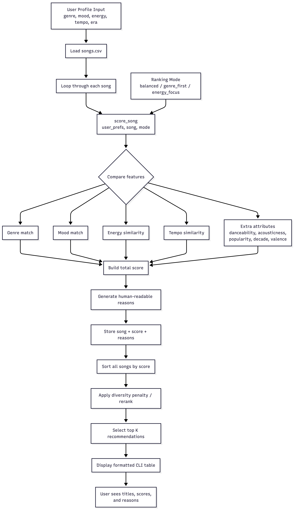
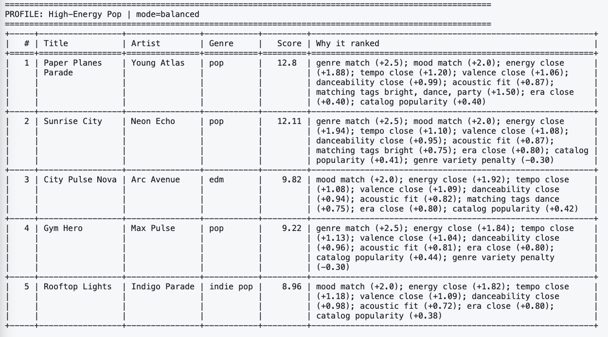
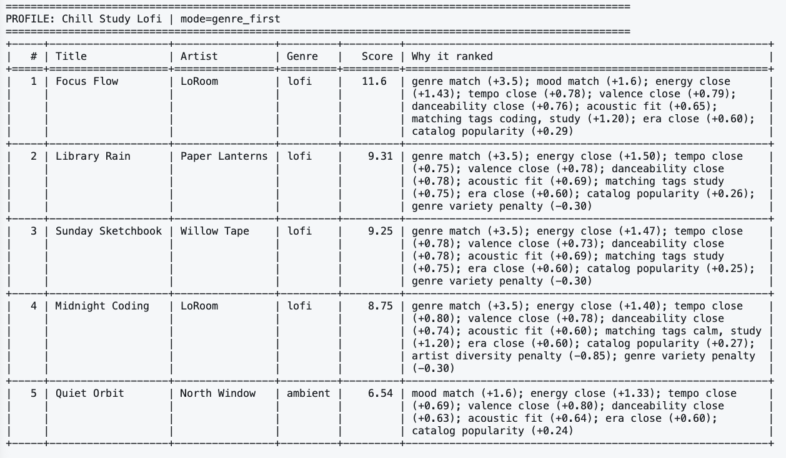
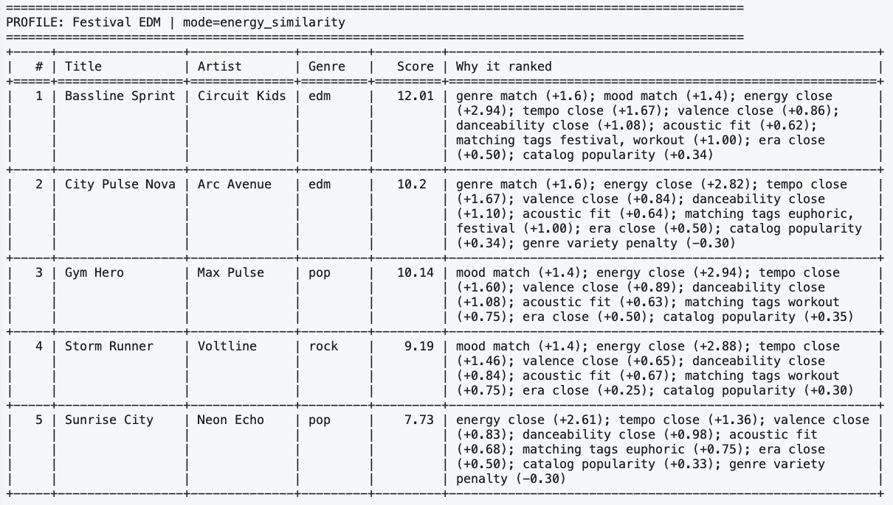
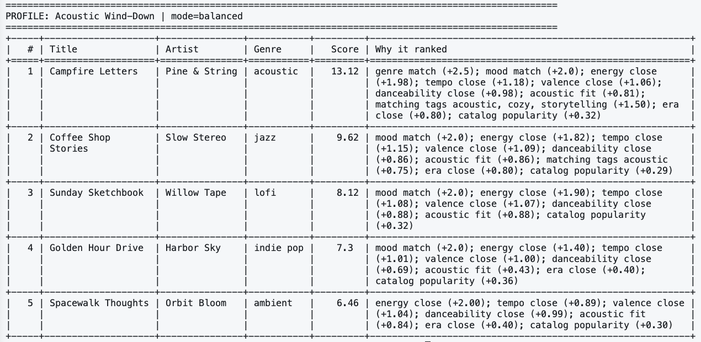

# 🎵 Music Recommender Simulation

## Project Summary

This project is a **content-based music recommender simulator**. It compares a user profile to a small song catalog and scores each song using features like genre, mood, energy, tempo, valence, danceability, acousticness, decade, popularity, and mood tags. The system then ranks the songs, applies a small diversity penalty so one artist or genre does not take over the whole list, and prints a readable explanation for why each recommendation was chosen.

Real platforms like Spotify, YouTube, and TikTok usually combine **two big ideas**:

- **Collaborative filtering:** recommend items that similar users liked, skipped less, saved, or replayed.
- **Content-based filtering:** recommend items with attributes similar to things the user already enjoys, like genre, tempo, mood, or energy.

In those systems, the **input data** includes user actions and song/video features, **user preferences** are inferred from patterns in that data, and the **ranking model** chooses what to show first. My simulator only uses the content-based side, so it is smaller, easier to explain, and more transparent.

---

## How The System Works

### Features used by each song

Each song in `data/songs.csv` includes:

- `genre`
- `mood`
- `energy`
- `tempo_bpm`
- `valence`
- `danceability`
- `acousticness`
- `popularity`
- `release_decade`
- `instrumentalness`
- `liveness`
- `mood_tags`

The starter file had 10 songs. I expanded it to **20 songs** and added **5 extra attributes**: popularity, release decade, instrumentalness, liveness, and mood tags.

### What the user profile stores

A user profile stores the listener's target preferences:

- favorite genre
- favorite mood
- target energy
- target tempo
- target valence
- target danceability
- whether they like acoustic songs
- preferred decade
- desired tags
- ranking mode

### Scoring rule

The recommender gives points in two ways:

1. **Exact matches** for categorical features.
   - genre match adds a bigger bonus
   - mood match adds a medium bonus
2. **Closeness scores** for numeric features.
   - songs get more points when their energy, tempo, valence, danceability, or acousticness are closer to the user's target values

It also adds:

- a small bonus for matching detailed `mood_tags`
- a small bonus when the release decade is close to the user's preferred era
- a small popularity prior

### Ranking rule

After every song gets a numeric score, the system sorts the catalog from highest to lowest. Then it runs a **diversity reranker** that subtracts a small amount if an artist or genre already appears in the top picks. That makes the top 5 a little less repetitive.

### Ranking modes

The project includes three scoring strategies:

- `balanced`
- `genre_first`
- `energy_similarity`

This is a simple version of a **strategy pattern**: the same recommender function runs, but different weight presets change what matters most.

### Mermaid flowchart



<!-- ```text
flowchart TD
    A[User Profile Input<br/>genre, mood, energy, tempo, era] --> B[Load songs.csv]
    B --> C[Loop through each song]
    C --> D[score_song(user_prefs, song, mode)]
    M[Ranking Mode<br/>balanced / genre_first / energy_focus] --> D

    D --> E{Compare features}
    E --> E1[Genre match]
    E --> E2[Mood match]
    E --> E3[Energy similarity]
    E --> E4[Tempo similarity]
    E --> E5[Extra attributes<br/>danceability, acousticness, popularity, decade, valence]

    E1 --> F[Build total score]
    E2 --> F
    E3 --> F
    E4 --> F
    E5 --> F

    F --> G[Generate human-readable reasons]
    G --> H[Store song + score + reasons]
    H --> I[Sort all songs by score]
    I --> J[Apply diversity penalty / rerank]
    J --> K[Select top K recommendations]
    K --> L[Display formatted CLI table]
    L --> N[User sees titles, scores, and reasons]
``` -->

---

## Getting Started

### Setup

1. Create a virtual environment (optional but recommended):
```bash
python -m venv .venv
source .venv/bin/activate      # Mac or Linux
```

2. Install dependencies

```bash
pip install -r requirements.txt
```

3. Run the app:

```bash
python -m src.main
```

### Running Tests

Run the starter tests with:

```bash
pytest
```

You can add more tests in `tests/test_recommender.py`.

---

## Recommendation Results

The CLI prints a formatted table with the title, artist, score, and the exact reasons behind each ranking.

### Profile 1: High-Energy Pop

Top songs:

1. **Paper Planes Parade**
2. **Sunrise City**
3. **City Pulse Nova**

Why this makes sense: the profile wants happy, danceable, high-energy music, so upbeat pop and EDM songs rise to the top.



### Profile 2: Chill Study Lofi

Top songs:

1. **Focus Flow**
2. **Library Rain**
3. **Sunday Sketchbook**

Why this makes sense: the profile wants low energy, acoustic-friendly, study-oriented songs. Lofi tracks with `study`, `coding`, and `calm` tags score well.



### Profile 3: Festival EDM

Top songs:

1. **Bassline Sprint**
2. **City Pulse Nova**
3. **Gym Hero**

Why this makes sense: the profile strongly rewards intense energy, fast tempo, high danceability, and festival/workout tags.



### Profile 4: Acoustic Wind-Down

Top songs:

1. **Campfire Letters**
2. **Coffee Shop Stories**
3. **Sunday Sketchbook**

Why this makes sense: the profile prefers low energy, relaxed mood, strong acousticness, and cozy tags.



---
## Experiments You Tried

Use this section to document the experiments you ran. For example:

- What happened when you changed the weight on genre from 2.0 to 0.5
- What happened when you added tempo or valence to the score
- How did your system behave for different types of users

Response:
### Experiment 1: Different user profiles

The same scoring code behaved very differently depending on the profile.

- **High-Energy Pop** pushed danceable pop and bright EDM upward.
- **Chill Study Lofi** moved slow, acoustic-friendly lofi songs to the top.
- **Festival EDM** favored high-tempo, intense tracks, even when they were not pure EDM.
- **Acoustic Wind-Down** shifted toward cozy, low-energy, acoustic songs.

This showed that the profile really does control the output, rather than the system always recommending the same top songs.

### Experiment 2: Compare ranking modes

I used the `Festival EDM` profile to compare ranking strategies.

- In `balanced` mode, the top songs were still mostly EDM, but genre and mood mattered more.
- In `energy_similarity` mode, **Gym Hero** and **Storm Runner** climbed higher because they are very close on energy and tempo, even though they are pop/rock instead of EDM.

That experiment made the system feel more realistic: different platforms or product goals could legitimately choose different ranking rules.

### Experiment 3: Diversity penalty

Without a diversity step, repeated artists or genres can dominate the list. With the diversity penalty turned on:

- duplicate artists get a larger penalty
- duplicate genres get a smaller penalty

A good example is the `Chill Study Lofi` profile. **Midnight Coding** still ranks well, but it drops below **Quiet Orbit** because **Focus Flow** from the same artist already appeared earlier.

---

## Limitations and Risks

Summarize some limitations of your recommender.

Examples:

- It only works on a tiny catalog
- It does not understand lyrics or language
- It might over favor one genre or mood

You will go deeper on this in your model card.

Response: The existing recommendation system is very limited to what it can do. 

- The catalog is tiny, so some users will not have enough true matches.
- The weights are hand-tuned, not learned from real listening behavior.
- Genre labels are coarse and subjective.
- The popularity bonus can bias the system toward already-strong songs.
- Mood is simplified to one label plus tags, even though real taste is much more complex.
- The diversity penalty improves fairness a little, but it is still a very small rule-based fix.

---

## Reflection

Write 1 to 2 paragraphs here about what you learned:

- about how recommenders turn data into predictions
- about where bias or unfairness could show up in systems like this

Response: In this recommendation system, a weighted scoring function and sorting already creates recommendations that look international. Feature selection, label definitions, and weights are very important for recommendations to feel convincing. A single change to energy weight or genre weight can change the behavior of an entire system.

For more details, refer to the full write-up:
- [Model Card](model_card.md)
- [Reflection Notes](reflection.md)

## AI Usage Note

>**Note:** This system was initially designed independently and later enhanced with assistance from AI tools. All final code was manually reviewed, tested, and verified to ensure correctness and alignment with the project requirements.